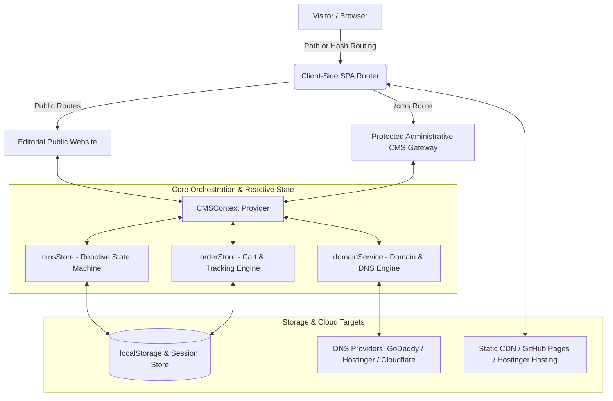

# LataTea — Professional Website, Media Management System & Domain Management Engine

[](https://github.com/PTejasKr/LataTea/actions/workflows/deploy.yml)
[](https://nodejs.org)
[](https://vitejs.dev/)
[](https://react.dev/)
[](https://tailwindcss.com/)

> **LataTea** is a commercial-grade, premium FMCG and B2B tea-brand web application and content management system. It pairs an editorial brand storytelling frontend inspired by leading corporate FMCG platforms (**CCL Products** and **Modi Tea**) with an administrative **Media Management System (CMS)** and a provider-agnostic **Domain Management Engine**.

---

## 📑 Table of Contents
1. [Architecture Overview](#-architecture-overview)
2. [Service Nodes & Microservice Abstractions](#-service-nodes--microservice-abstractions)
3. [Content & Media Management System (CMS)](#-content--media-management-system-cms)
4. [Domain Management & Multi-Host Engine](#-domain-management--multi-host-engine)
5. [Information Architecture & Route Mapping](#-information-architecture--route-mapping)
6. [Design System & Typography](#-design-system--typography)
7. [Statutory & Compliance Details](#-statutory--compliance-details)
8. [Local Development & Build](#-local-development--build)
9. [Deployment (Vercel & GitHub Pages)](#-deployment-vercel--github-pages)

---

## 🏛️ Architecture Overview

The system operates across a modular 3-tier client architecture separating presentation, orchestration, and deterministic services:



### Key Architectural Tenets:
- **Resilient Client SPA Routing**: Custom zero-dependency router supporting both clean path URLs (`/products/gud-tea`) and hash fallbacks (`#/products/gud-tea`) to guarantee zero 404 errors across any static host or web server.
- **Two-Tier State Pipeline**: Independent `draftState` (for staging edits) and `publishedState` (for live production display) with pre-publication validation gates.
- **Dynamic Runtime `/cms` Routing**: Administrative access is decoupled from fixed hostnames, allowing `https://<any-custom-domain>/cms` to access the CMS.

---

## ⚙️ Service Nodes & Microservice Abstractions

The application organizes core logic into deterministic service modules:

### 1. `domainService.ts` (Domain & DNS Engine)
- **Provider Abstraction**: Decouples registrar configurations (**GoDaddy**, **Namecheap**, **Google Domains**) from hosting targets (**Hostinger**, **Cloudflare Pages**, **GitHub Pages**, **Vercel**, **Custom VPS**).
- **RFC 1035 Hostname Validator**: Real-time sanitation and format enforcement for apex domains and subdomains.
- **DNS Record Generator**: Automatically computes required **A Records** (Anycast IPs) and **CNAME Records** with TTL specifications.
- **Canonical URL Synchronizer**: Automatically updates SEO canonical links and Open Graph meta tags when a primary domain is selected.

### 2. `cmsStore.ts` (Content & Media State Machine)
- **Validation Engine**: Performs mandatory pre-publish checks (validates hero headlines, product names, pack configurations, and media slots).
- **Schema Migration**: Auto-merges and migrates outdated `localStorage` schemas (`latatea_cms_published_v2`) to eliminate hydration exceptions.
- **Focal Point Resolver**: Translates percentage-based X/Y coordinates into CSS `object-position` rules for responsive art direction.

### 3. `orderStore.ts` (Commerce & Courier Tracking Node)
- **Direct Cart Engine**: Real-time quantity keypad editing, line item calculation, and GST/shipping computations.
- **Consignment Tracking Simulator**: Multi-stage delivery timeline (`Order Placed` ➔ `Quality Inspection` ➔ `Dispatched` ➔ `In Transit` ➔ `Delivered`) with courier waypoint tracking.
- **Payment Gateway Scaffold**: Official IDFC First Bank RTGS / NEFT / UPI settlement details with 1-click clipboard copying.

---

## 🎛️ Content & Media Management System (CMS)

The **Media Management System** is accessed via `/cms` and secured with administrator credentials:
- **Username**: `Murjo Basu`
- **Password**: `Basu@123`

```
┌─────────────────────────────────────────────────────────────┐
│                   CMS Navigation Modules                    │
├───────────────────┬─────────────────────────────────────────┤
│ Module            │ Purpose                                 │
├───────────────────┼─────────────────────────────────────────┤
│ 1. Dashboard      │ Completion scorecards, health & alerts  │
│ 2. Website Text   │ Headlines, subheadlines, recipe copy    │
│ 3. Navigation     │ Header mega-menu and link ordering      │
│ 4. Product Mgr    │ Slugs, pack sizes, formulation, pricing │
│ 5. B2B Solutions  │ Copy for Corporate, Hotel, Café sectors │
│ 6. Domain Mgr     │ GoDaddy/Hostinger DNS, SSL & Canonical  │
│ 7. Image Position │ X/Y Focal point editor & crop simulator │
│ 8. Media Library  │ Asset uploader, alt text, file sizes    │
│ 9. Sections       │ Enable/disable and reorder page blocks  │
│ 10. Brand Tokens  │ Color palette, logo slots & typography  │
│ 11. SEO Config    │ Meta titles, descriptions, OG cards     │
└───────────────────┴─────────────────────────────────────────┘
```

### Save & Publish Workflow:
1. **Stage Changes**: Administrator edits text, swaps images, or reconfigures domains in draft mode.
2. **Draft Preview**: Click **"Preview"** to simulate the live website across Desktop, Tablet, and Mobile viewports.
3. **Validate & Publish**: System runs validation rules. If valid, the draft is promoted to `publishedState`, cache listeners fire, and the live website updates instantly.

---

## 🌐 Domain Management & Multi-Host Engine

The built-in **Domain Management** portal provides non-technical administrators with a clear interface for connecting and maintaining domains.

### Future Migration Workflow (GoDaddy ➔ Hostinger):
1. **Registrar (GoDaddy)**: Log into GoDaddy DNS Management.
2. **Hostinger Target**: Add the generated **A Record** (`@` pointing to Hostinger IP) and **CNAME Record** (`www` pointing to `latatea.com`).
3. **CMS Verification**: Open `/cms` ➔ **Domain Management**, click **`+ Add Domain`**, enter `latatea.com`, and click **"Verify DNS"**.
4. **Canonical Primary**: Click **"Make Primary"** to sync all canonical tags and sitemaps.

---

## 🗺️ Information Architecture & Route Mapping

### Public Frontend Routes
- `/`: **Homepage** — 10-step editorial brand journey (Hero, The Promise, Why Lata, Product Worlds, Signature Catalogue, Industry Solutions, 3-Minute Preparation, Story Teaser, Consignment Tracking, Enterprise Sample CTA).
- `/about`: **About Us** — Company heritage, ISO & FSSAI certified cleanroom manufacturing facility.
- `/our-story` *(alias `/story`)*: **Brand Heritage** — Assam harvest roots, organic jaggery philosophy, spice sourcing.
- `/products`: **Catalogue** — Category filtering across Gud Tea, Sugar Tea, and Vending Premixes.
- `/products/:slug`: **Product Detail** — High-res imagery, nutritional features, ingredients, pack switcher, and direct cart addition.
- `/solutions/:slug`: **B2B Sector Deep Dives**:
  - `/solutions/corporate` (Corporate Pantries & IT Parks)
  - `/solutions/hotels` (Hotels & Luxury Banquets)
  - `/solutions/restaurants` (Fine Dining & QSRs)
  - `/solutions/cafes` (Modern Craft Chai Lounges)
  - `/solutions/retail` (Supermarkets & FMCG Distributors)
  - `/solutions/vending` (Automatic Vending Operators)
- `/preparation`: **Brewing Guide** — Master 160g recipe (1:1 water/milk ratio) and visual timeline.
- `/track`: **Order Tracking** — Live airway bill consignment tracker.
- `/contact` *(alias `/samples`)*: **Contact & Statutory Portal** — Quotation form, 3 statutory cards, and 1-Click WhatsApp chat.
- `/privacy` & `/terms`: **Legal Compliance** — Corporate data policies and commercial wholesale terms.

---

## 🎨 Design System & Typography

- **Primary Colors**: Deep Tea Green (`#1E3F20`), Warm Cream (`#FAF6EE`), Lata Amber/Orange (`#E58A1F`), Leaf Green (`#8DB843`).
- **Typography Tokens**:
  - **Display Serif**: *Playfair Display* / *Rozha One* (Google Fonts, SIL Open Font License).
  - **Body Sans**: *Plus Jakarta Sans* (Google Fonts, SIL Open Font License).
- **Responsive Breakpoints**: Seamlessly verified across `375px`, `390px`, `414px`, `768px`, `1024px`, `1280px`, `1440px`, and `1920px`.

---

## 🏛️ Statutory & Compliance Details

```
Company Name:       Purple Bean Agro Industries Private Limited
Corporate Address:  Office 12, Business Avenue, Aundh, Pune, Maharashtra 411012
Official Email:     info@latatea.com
Direct Phones:      +91 7666953873 | +91 8483067383 | +91 9595333976
1-Click WhatsApp:   https://wa.me/917666953873

FSSAI License No:   11525996000709
GSTIN:              27AAPCP3820M1ZX
IEC Code:           AAPCP3820M

Commercial Banking: IDFC First Bank
Beneficiary Name:   Purple Bean Agro Industries Private Limited
Account Number:     10227953860
IFSC Code:          IDFB0041438
```

---

## 💻 Local Development & Build

### Prerequisites
- **Node.js**: v18+ or v20+
- **npm**: v9+

### Setup & Run
```bash
# 1. Install dependencies
npm install

# 2. Run local development server
npm run dev

# 3. Open in browser
http://localhost:5173/
```

### Production Build & Lint
```bash
# Type check and build optimized bundle
npm run build

# Preview production build locally
npm run preview
```

---

## 🚀 Deployment (Vercel & GitHub Pages)

### 1. Vercel Cloud Deployment (Recommended)
This repository is configured with [`vercel.json`](./vercel.json) to handle single-page application (SPA) client-side rewrites automatically.

#### Live Vercel URLs:
* 🌐 **Main Public Website**: `https://lata-tea.vercel.app/`
* 🛠️ **Administrative CMS Portal**: `https://lata-tea.vercel.app/cms` *(or `https://lata-tea.vercel.app/#cms`)*

#### Deploying to Vercel:
1. **Via Vercel CLI**:
   ```bash
   # Login and link project
   vercel login
   
   # Deploy to production
   vercel --prod
   ```
2. **Via Vercel Web Dashboard / GitHub Integration**:
   - Go to [vercel.com/new](https://vercel.com/new) and import `https://github.com/PTejasKr/LataTea`.
   - Framework Preset: **Vite**
   - Root Directory: `./`
   - Build Command: `npm run build`
   - Output Directory: `dist`
   - Click **Deploy**.

---

### 2. GitHub Pages Deployment (Automated CI/CD)
This repository includes an automated CI/CD workflow located at [`.github/workflows/deploy.yml`](.github/workflows/deploy.yml).

1. Go to repository settings: [**https://github.com/PTejasKr/LataTea/settings/pages**](https://github.com/PTejasKr/LataTea/settings/pages)
2. Under **"Build and deployment"** ➔ **"Source"**, choose **`GitHub Actions`**.
3. Every commit pushed to `main` will automatically build and publish to:
   🌐 **`https://ptejaskr.github.io/LataTea/`**

---

### 📄 License
Proprietary & Confidential — **Purple Bean Agro Industries Private Limited**. All rights reserved.
