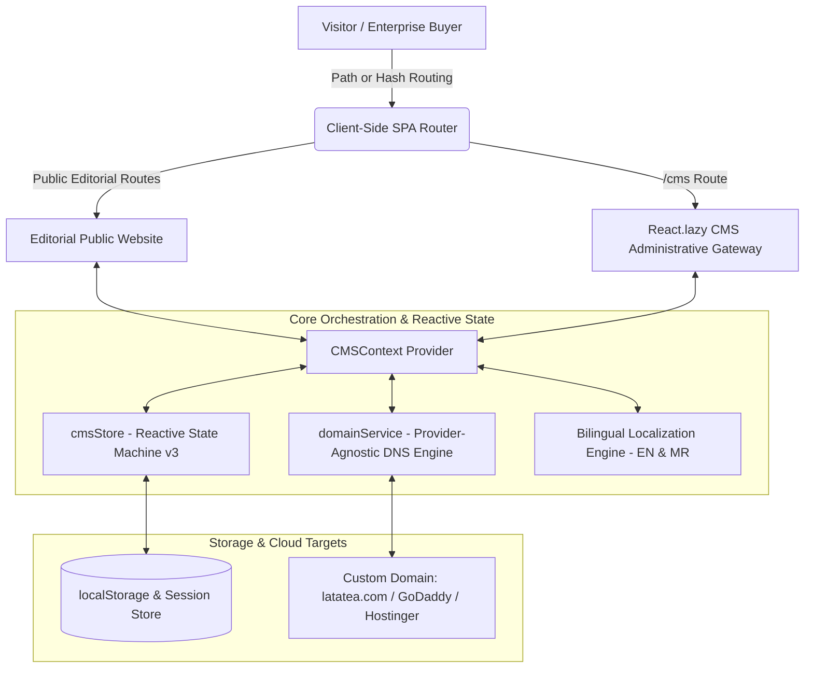

# LataTea — Sovereign Editorial Tea Brand Website & Storytelling CMS

[](https://github.com/PTejasKr/LataTea/actions/workflows/deploy.yml)
[](https://nodejs.org)
[](https://vitejs.dev/)
[](https://react.dev/)
[](https://tailwindcss.com/)

> **LataTea** is a professional, visual, and story-driven Indian tea brand platform and bilingual Content Management System (CMS). Built with a clear product catalogue and brand narrative, it presents an uncompromising standard of pure unrefined cane jaggery, authentic Assam CTC harvest, and traditional Maharashtrian Basundi Chai for businesses, distributors, and tea lovers.

---

## 📑 Table of Contents
1. [Core Philosophy & Architecture](#-core-philosophy--architecture)
2. [Storytelling Homepage Narrative Arc](#-storytelling-homepage-narrative-arc)
3. [Bilingual System (English & Marathi)](#-bilingual-system-english--marathi)
4. [Storytelling CMS Suite](#-storytelling-cms-suite)
5. [Domain Management & Infrastructure](#-domain-management--infrastructure)
6. [Low-Bandwidth Performance & Code Splitting](#-low-bandwidth-performance--code-splitting)
7. [Statutory & Compliance Details](#-statutory--compliance-details)
8. [Local Development & Production Build](#-local-development--production-build)

---

## 🏛️ Core Philosophy & Architecture

The website prioritizes **editorial storytelling, brand heritage, and wholesale/enterprise sample inquiries** over retail checkout carts. All shopping carts, delivery estimators, and consignment tracking mechanisms have been cleanly pruned.



---

## 📜 Storytelling Homepage Narrative Arc

The public homepage is structured as an unbroken 11-step editorial narrative:

1. **01 — Hero**: Panoramic photograph, large display typography (`Cinzel` / `Rozha One`), and concise brand statement: *"Where Royal Indian Tradition Meets Pure Jaggery Craft"*.
2. **02 — The Story**: *"A Reverence for the Timeless Indian Chai Gathering"* — narrative covering Maharashtra festive origins and jaggery convictions.
3. **03 — Heritage**: Typographic milestone timeline tracing agricultural roots from Kolhapur sugarcane nectar to Assam tea estates.
4. **04 — The Craft (5 Stages)**:
   - `01 — SOURCE`: Selected Assam CTC leaves.
   - `02 — SELECT`: Whole sun-ripened green cardamom, ginger roots, mace, and nutmeg.
   - `03 — BLEND`: Micro-compounded precision ratios that never curdle boiling milk.
   - `04 — PREPARE`: 3-minute 1:1 milk and water simmering ritual.
   - `05 — EXPERIENCE`: A royal, comforting golden cup of Basundi Chai.
5. **05 — Tea Stories**: Non-commerce showcase highlighting tasting profiles, ingredients, and harvest origin.
6. **06 — The Experience**: Sensory chronicle of aroma blooming, velvety dairy texture, and lingering ginger warmth.
7. **07 — Collection**: Clean categorization (Jaggery Heritage, Royal Basundi, Instant Premixes).
8. **08 — Why Lata Tea**: 4 verified differentiators (100% Organic Jaggery, Zero Curdling, ISO & FSSAI Cleanroom, 3-Minute Simmer).
9. **09 — Contact & Statutory**: Verified corporate credentials, 1-Click WhatsApp direct channel, bank coordinates.
10. **10 — Concluding Brand Statement**: *"A ritual of purity in every boiling cup."*
11. **11 — Minimal Footer**: Corporate copyright, statutory license numbers, bilingual links, language toggle.

---

## 🌐 Bilingual System (English & Marathi)

- **Centralized Content Model**: All editorial fields, navigation labels, tasting notes, and headlines implement `LocalizedString { en: string; mr: string; }`.
- **Default Language**: English (`en`).
- **One-Click Switcher**: `EN | मराठी` toggle button in the header and footer with animated active pill states.
- **Persistence**: User language preference is stored in `localStorage.getItem('latatea_preferred_lang')` and automatically applied to the document root `<html lang="...">`.
- **Typography**: Devanagari font rendering supported via Google Fonts (`Noto Serif Devanagari`, `Rozha One`, `Mukta`, and `Yatra One`).

---

## 🛠️ Storytelling CMS Suite

Accessible at `https://<domain>/cms` or `/#/cms`.

### Credentials
- **Authorized Username**: `Murjo Basu`
- **Authorized Password**: `Basu@123`

### Administrative Modules
1. **Dashboard**: Live site status, English vs Marathi translation coverage %, active domain monitor, and publish triggers.
2. **Story & Heritage**: Bilingual editor for brand origins, philosophy paragraphs, pull quotes, and chronological milestones.
3. **The Craft / Process**: Detailed editor for the 5 sequential craft stages.
4. **Tea Stories**: Add, edit, or hide tea blends with tasting notes and origins (zero pricing or shopping configurations).
5. **Languages**: Localization audit dashboard displaying translation coverage percentages and missing fields warnings.
6. **Navigation Manager**: Reorder, add, or toggle visibility of navigation links with bilingual labels.
7. **Domain Management**: Connect custom domains, configure DNS A/CNAME records (GoDaddy / Hostinger), verify SSL, and enforce `/cms` routing.
8. **Media Library & Focal Point Editor**: Upload brand assets and adjust focal points (`object-position`) for desktop and mobile viewports.
9. **SEO & Open Graph**: Bilingual meta titles, descriptions, canonical URLs, and Google SERP preview.

---

## 🌐 Domain Management & Infrastructure

The CMS features a dedicated **Domain Manager**:
- **Primary Domain**: `latatea.com`
- **Redirects**: `www.latatea.com` ➔ `latatea.com`
- **Registrar Support**: Step-by-step guides for **GoDaddy**, **Hostinger**, **Namecheap**, and **Cloudflare**.
- **DNS Records**:
  - `A Record`: `@` ➔ `185.199.108.153` (or hosting IP)
  - `CNAME Record`: `www` ➔ `latatea.com`
- **Path Routing**: Automatically maintains `/cms` administrative accessibility across any wired custom domain.

---

## ⚡ Low-Bandwidth Performance & Code Splitting

- **Target Connection**: Usable on throttled mobile connections (< 100 KB/s).
- **Dynamic Chunk Isolation**: The CMS administration bundle (`AdminView`) is dynamically loaded via `React.lazy()` and `Suspense`. Public visitors download **zero administrative code** (saving ~125 KB gzipped on first paint).
- **Lightweight Dependencies**: Built strictly with React 19, Lucide React, and Tailwind CSS. No heavy 3D or WebGL runtime dependencies.
- **Image Optimization**: Preconnected Google Fonts, preloaded critical panoramic assets, and modern responsive CSS layout.

---

## 🏛️ Statutory & Compliance Details

All claims and corporate details on the platform are verified:

- **Entity**: `Purple Bean Agro Industries Private Limited`
- **Corporate Address**: `Office 12, Business Avenue, Aundh, Pune, Maharashtra 411012`
- **Official Email**: `info@latatea.com`
- **Direct Contacts**: `+91 7666953873` • `+91 8483067383` • `+91 9595333976`
- **1-Click WhatsApp**: `https://wa.me/917666953873`
- **FSSAI License No**: `11525996000709`
- **GST Identification (GSTIN)**: `27AAPCP3820M1ZX`
- **Importer-Exporter Code (IEC)**: `AAPCP3820M`
- **Bank**: `IDFC First Bank` | **A/C**: `10227953860` | **IFSC**: `IDFB0041438`

---

## 🚀 Local Development & Production Build

### Prerequisites
- Node.js 18+ (Node 20 Recommended)
- npm 9+

### Commands
```bash
# 1. Install dependencies
npm install

# 2. Run local development server
npm run dev

# 3. Build optimized production bundle
npm run build

# 4. Preview production build locally
npm run preview
```
